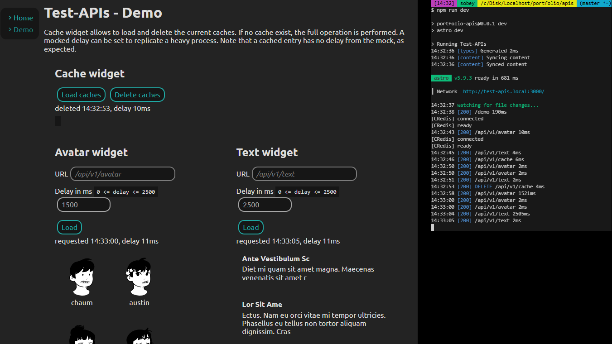

# Portfolio/apis

## Introduction

Exercise to load various API endpoints and cache them.

This application demonstrates loading multiple micro-services and load their content very efficiently with caching.

## Setup

1. `npm i` to install dependencies
2. create `.env` by duplicating `.env.development`
3. `npm run dev` to run localhost
4. `docker run -p 6379:6379 -d redis:8.0-rc1` to run docker redis

**Important**
Make sure your virtual host is added for custom `SERVER_HOST`

* Windows: C:\Windows\System32\drivers\etc\hosts
* Mac: /private/etc/hosts
* Linux: /etc/hosts

```
127.0.0.1 localhost test-apis.local my-custom-domain.env
```

## ENV Configs
* `SERVER_HOST: string` name of the test environment, ex `'localhost', 'test-mall.local', 'my-custom-domain.env'`
* `SERVER_PORT: int` port number of the test environment

### Pages

1. `http://test-widgets.local:3000/` home page, explains the basics
2. `http://test-widgets.local:3000/demo` demo page, showcases the exercise


