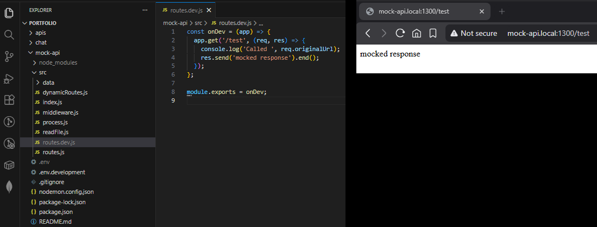

# Portfolio/mock-api

## Introduction

Stand-alone API tool to return mocked results.

This application allows to run a mocked server locally. It was very useful when building front-end applications when back-end wasn't ready yet. It was also very useful when working with purchases and managing account memberships.

This application is intentionally small and straight to the point. Since it is a mocked server, "if you are using too much logic, you arenot mocking anymore".

### Setup

1. `npm i` to install packages
2. `cp .env.development .env` to create your local environment file
3. `npm run dev` to run the application

### Configs

* `SERVER_HOST` string - mocked domain name to run the application
* `SERVER_PORT` int - mocked port to run the application
* `TIMEOUT` string - maximum timeout in seconds for responses, ex "5s" = 5 seconds

## Using Mock-API

### Custom routes

1. Create `src/routes.dev.js` file, _src/dynamicRoutes.js_ should automatically include the file into the application
2. Create a function with the ExpressJS application as a parameter
3. Export your function
4. Write your own endpoints

```
// src/routes.dev.js - example
const onDev = app => {
    app.use('/test', (req, res) => {
        console.log('Called ', req.originalUrl);
        res.send('mocked response').end();
    });
};

module.exports = onDev;
```

#### Multiple routes

If you need to host a lot of custom endpoints, it is recommended to split them among files. Keep your files under `src/routes/*.js` and they should be automatically included (as per custom routes above).



### Local data

You can store test files locally. It avoid having to hardcoded large among of data directly into your routes. These files can then be used via the `src/readfile.js` helper.

```
// assume 'src/data/some-big-data.json' exists
// assume 'src/data/dir/subdirectory/lorem-ipsum.html' exists

// src/routes/load.js
const readFile = require('../readFile');

app.use('/test-load-file', (req, res) => {
    const jsonData = readFile('some-big-data.json'); // 'true' by default, returns as JSON object
    const htmlData = readFile('dir/subdirectory/lorem-ipsum.html', false); // 'false' to return as string
});
```
