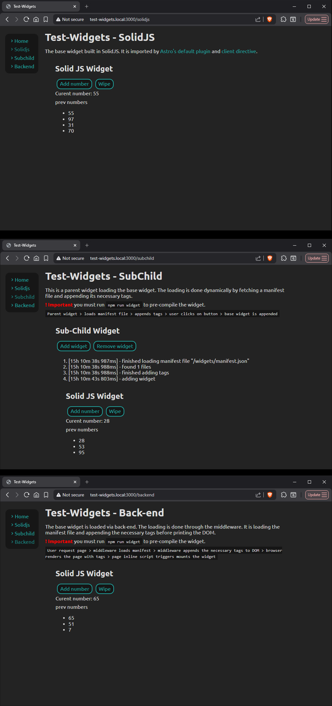

# Portfolio/widgets

## Introduction

Various methods to import front-end widgets to the DOM.

This application shows importing a small SolidJS application via various methods. The first method imports by Astro's default directives. The second method loads a _manifest.json_ file via JS and then inserts it into the DOM. The third method loads the manifest file via back-end and then prints the necessary content into the DOM.

## Setup

1. `npm i` to install dependencies
2. create `.env` by duplicating `.env.development`
3. `npm run dev` to run localhost
4. `npm run widget` to pre-compile the widget

**Important**
Make sure your virtual host is added for custom `SERVER_HOST`

* Windows: C:\Windows\System32\drivers\etc\hosts
* Mac: /private/etc/hosts
* Linux: /etc/hosts

```
127.0.0.1 localhost test-widgets.local my-custom-domain.env
```

## ENV Configs
* `SERVER_HOST: string` name of the test environment, ex `'localhost', 'test-mall.local', 'my-custom-domain.env'`
* `SERVER_PORT: int` port number of the test environment

### Pages

1. `http://test-widgets.local:3000/` home page, explains the basics
2. `http://test-widgets.local:3000/solidjs` base widget page, explains the core widget
3. `http://test-widgets.local:3000/subchild` sub-child page, a parent widget loading the base widget
4. `http://test-widgets.local:3000/backend` back-end page, widget is loaded by back-end and mounted by front-end


